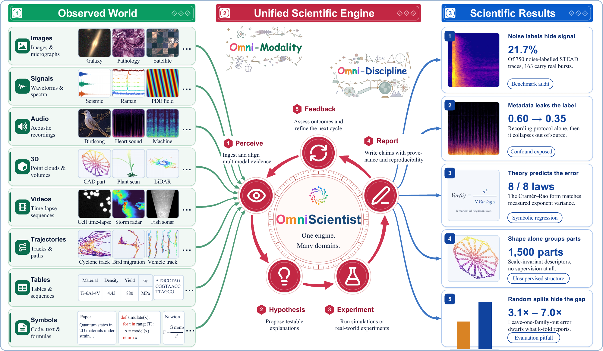
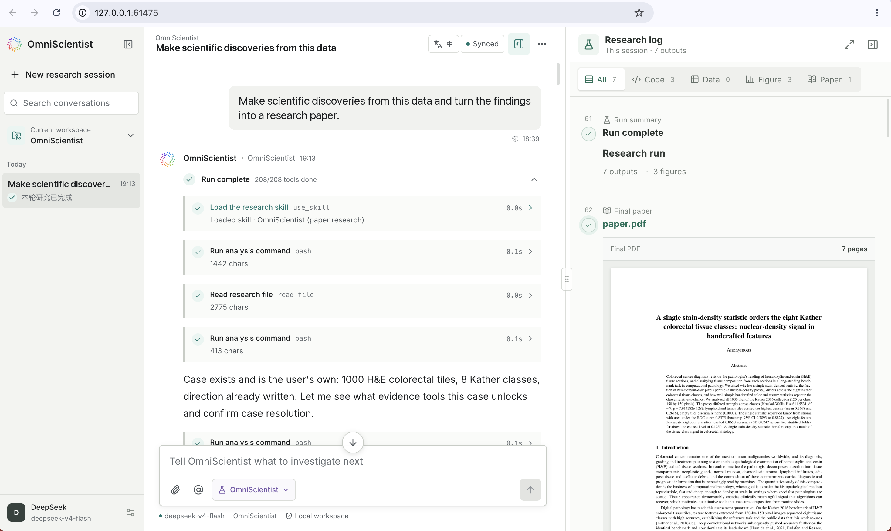
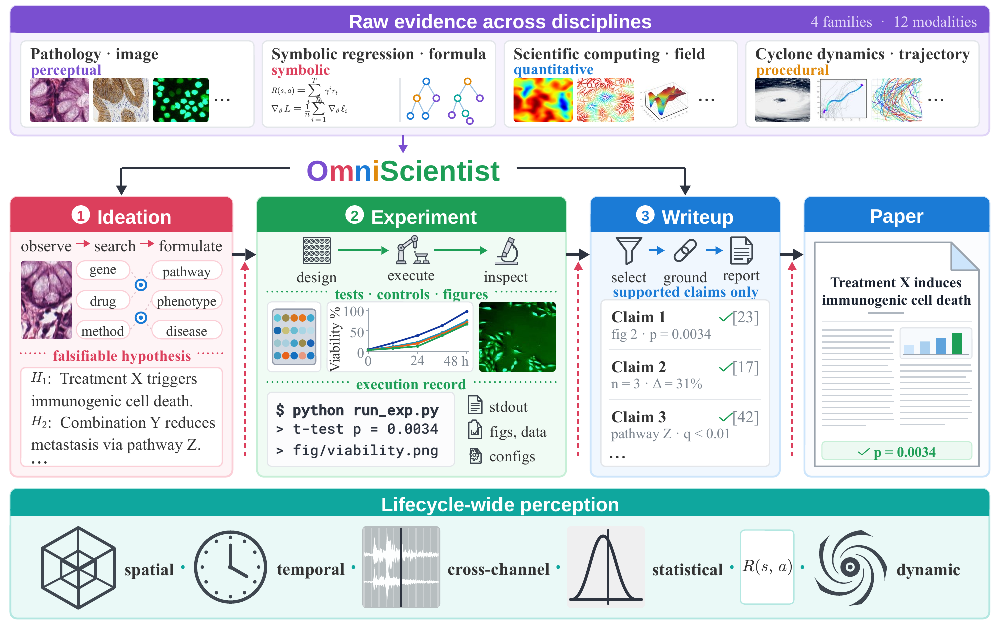
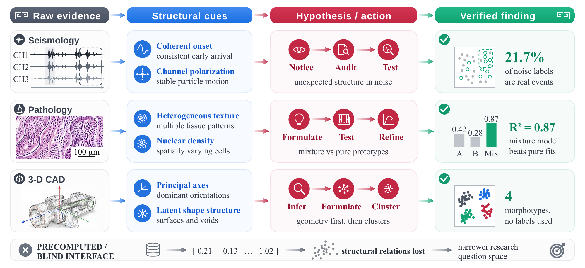
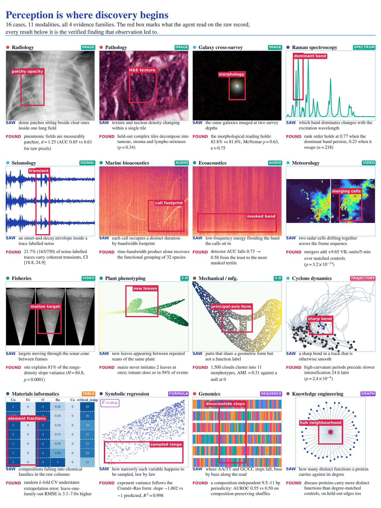

<div align="center">

<picture>
  <source media="(prefers-color-scheme: dark)" srcset="../assets/title-dark.png">
  
</picture>
<br/>

### An Omni-Modal, Omni-Discipline AI Scientist

<p align="center">
<a href="https://omni-scientist.github.io/"></a>
<a href="#citation"></a>
<a href="https://github.com/Omni-Scientist/OmniScientist/releases"></a>
<a href="../papers/"></a>
<a href="https://opensource.org/licenses/MIT"></a>
</p>

<p align="center">
<a href="https://www.python.org/downloads/"></a>
<a href="https://bun.sh/"></a>
<a href="https://platform.openai.com/"></a>
<a href="https://www.anthropic.com/"></a>
<a href="https://github.com/vllm-project/vllm"></a>
</p>

<p align="center">
<strong><a href="https://libobo.site">Bobo Li</a><sup>1</sup></strong> ·<!-- scan-leaks: allow, author attribution -->
<strong><a href="https://haofei.vip/">Hao Fei</a><sup>2,*</sup></strong> ·
<strong><a href="https://jometeorie.github.io/">Tianjie Ju</a><sup>1</sup></strong> ·
<strong><a href="https://www.comp.nus.edu.sg/~leeml/">Mong-Li Lee</a><sup>1</sup></strong> ·
<strong><a href="https://www.comp.nus.edu.sg/~whsu/">Wynne Hsu</a><sup>1</sup></strong>
<br/>
<sup>1</sup>National University of Singapore &nbsp;&nbsp;
<sup>2</sup>University of Oxford
<br/>
<sup>*</sup>Correspondence
<br/><br/>
<strong>Project website: <a href="https://omni-scientist.github.io/">omni-scientist.github.io</a></strong>
</p>

<br/>



</div>

OmniScientist is an autonomous AI agent that conducts research by perceiving raw
scientific data directly. Current AI agents reason over text and code, meaning raw
observations like microscopy images, seismograms, galaxy cutouts, and CT volumes only
reach them after humans reduce them to tables or numbers. OmniScientist examines the
primary material itself.

Provided with a research direction and a folder of data, the system runs a loop of
observation, reasoning, and action across the research lifecycle. It forms hypotheses
from what it sees, executes its own analyses, and drafts a paper whose claims trace
directly back to those experimental runs.

## Install

Paste this into Claude Code, Cursor, Codex, or anything else with a shell.

```text
Read https://omni-scientist.github.io/setup/install.md and install and configure the OmniScientist skill for this agent, following the steps.
```

For the desktop app or the terminal agent, get the line for your machine at
**[omni-scientist.github.io](https://omni-scientist.github.io/)**.

## Workbench

The desktop edition. A run streams into the transcript on the left while the research log
on the right collects every figure, script, and the compiled paper as they appear.



## Framework



Evidence enters as perceptual, symbolic, quantitative, or procedural data across twelve
modalities. One command runs three stages, each a tool-using loop that looks before it
acts, and each followed by a gate that must pass before the next begins.

- **Ideation** reads the evidence and forms a falsifiable hypothesis.
- **Experiment** runs code on real data and reads the resulting figures.
- **Writeup** drafts the paper, cites real literature, and compiles a PDF.

The gates are code, and they read an execution record rather than the draft. Every
number in the manuscript traces to real `stdout`, and a null result goes back to
ideation instead of being written up as a finding.



## Demos

A run ends at a compiled PDF containing figures, tables, and references that resolve to real DOIs. Five sample papers are in the [papers/](../papers/) directory.

As a worked example, the agent was pointed at STEAD seismic traces that carry a "noise" label. It read the three-component waveforms, found coherent arrivals in traces that should have contained none, and tested them against a surrogate null distribution it generated itself. The command that produces it is:

```bash
python engine/omniscientist/agentic.py --task stead_seismic --stage run
```

The resulting paper is titled [Coherent polarized signals in a substantial fraction of noise-labeled STEAD traces](../papers/seismology_stead_noise.pdf). It reports that 21.7% of the sampled noise-labeled traces carry real signal, with the false-alarm rate held at 1%.



## Citation

```bibtex
@article{omniscientist2026,
  title   = {OmniScientist: An Omni-Modal Omni-Discipline AI Scientist},
  author  = {Li, Bobo and Fei, Hao and Ju, Tianjie and Lee, Mong-Li and Hsu, Wynne},  % scan-leaks: allow
  journal = {arXiv preprint arXiv:2608.13558},
  year    = {2026}
}
```

## License

Released under the [MIT License](../LICENSE).
