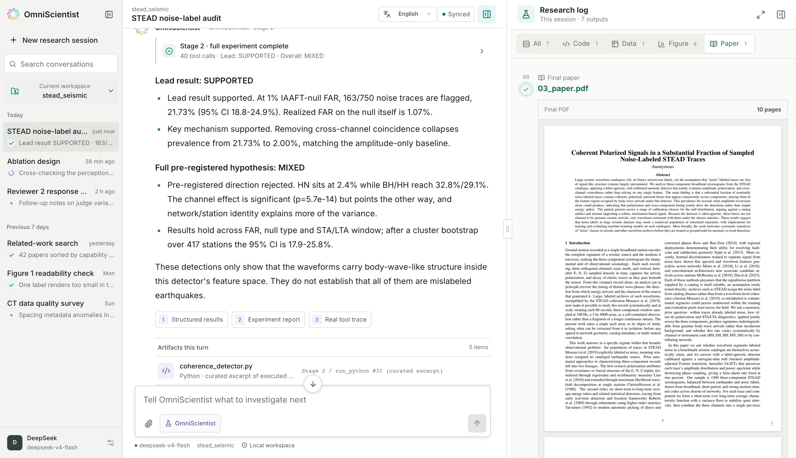
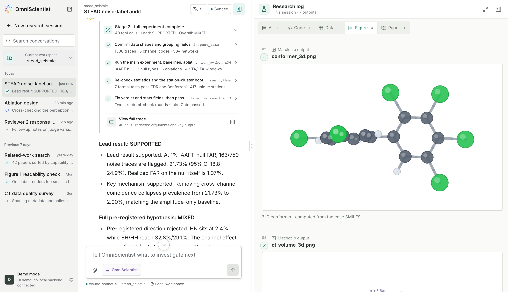
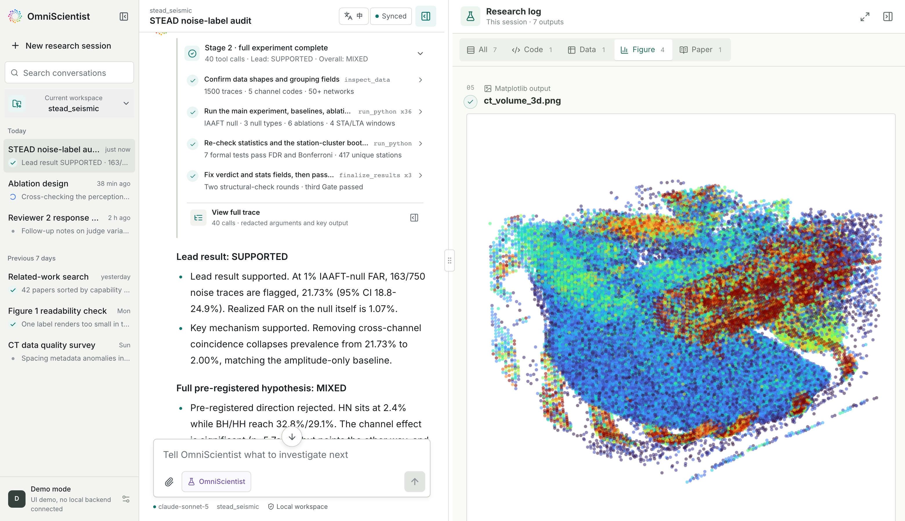

<div align="center">

<picture>
  <source media="(prefers-color-scheme: dark)" srcset="../../assets/title-dark.png">
  
</picture>
<br/>

### Ein offener, omni-modaler KI-Wissenschaftler, der auf Ihrem eigenen Rechner läuft

<p align="center">
<a href="https://github.com/Omni-Scientist/OmniScientist/releases/latest"></a>
<a href="https://github.com/Omni-Scientist/OmniScientist/actions/workflows/ci.yml"></a>
<a href="../INSTALL.md"></a>
<a href="https://omni-scientist.github.io/"></a>
<a href="../../LICENSE"></a>
</p>

<p align="center">


<a href="https://www.python.org/downloads/"></a>
<a href="https://bun.sh/"></a>
</p>

<p align="center">
<a href="../../README.md">English</a> · <a href="README_zh.md">简体中文</a> · <a href="README_fr.md">Français</a> · <a href="README_es.md">Español</a> · <a href="README_zh-Hant.md">繁體中文</a> · <a href="README_ja.md">日本語</a> · <a href="README_ko.md">한국어</a> · <a href="README_pt.md">Português</a> · <strong>Deutsch</strong> · <a href="README_ru.md">Русский</a>
</p>

</div>

---

https://github.com/user-attachments/assets/02477c18-28ff-4aad-a6bd-b54c6f032bc8

## Neuigkeiten

- **2026-09-02** · **Awesome AI Scientist.** Wir haben eine Sammlung für AI Scientists unter [Omni-Scientist/Awesome-AI-Scientist](https://github.com/Omni-Scientist/Awesome-AI-Scientist) veröffentlicht, mit Arbeiten, Systemen, Workbenches, Benchmarks und Datensätzen.
- **2026-08-24** · **Mehrsprachige Unterstützung.** Die Benutzeroberfläche des Arbeitsbereichs und diese Seite sind beide in mehreren Sprachen verfügbar, die oben auf dieser Seite aufgeführt und über die Symbolleiste in der App umgeschaltet werden. *([v0.1.3](https://github.com/Omni-Scientist/OmniScientist/releases/tag/v0.1.3))*
- **2026-08-23** · **Multimodale DeepSeek-Unterstützung.** `deepseek-v4-flash-vision-exp` ergänzt den Sidecar für die Wahrnehmung, sodass ein einziger DeepSeek-Schlüssel nun sowohl Reasoning als auch Vision abdeckt. *([v0.1.2](https://github.com/Omni-Scientist/OmniScientist/releases/tag/v0.1.2))*
- **2026-08-18** · **Erstes Patch-Release.** Release-Assets enthalten genau ein `SHA256SUMS`, und die Installationsprogramme verifizieren es vor der Installation. *([v0.1.1](https://github.com/Omni-Scientist/OmniScientist/releases/tag/v0.1.1))*
- **2026-08-16** · **Erste öffentliche Veröffentlichung.** Desktop-App, Terminal-Agent und ein Claude-Code-Skill aus einer einzigen Codebasis. *([v0.1.0](https://github.com/Omni-Scientist/OmniScientist/releases/tag/v0.1.0))*
- **2026-08-13** · **Technischer Bericht.** [arXiv:2608.13558](https://arxiv.org/abs/2608.13558), mit Läufen über zwölf Modalitäten.

---



Das kompilierte Paper neben dem Experiment-Trace; jede hervorgehobene Zahl verweist auf den Lauf, der sie erzeugt hat.



Ein Kugel-Stab-Konformer, berechnet aus dem eigenen SMILES des Chemie-Falls, das während des Laufs im Forschungsprotokoll eintrifft.



Ein 64³-CT-Volumen, als Punktwolke gelesen, neben den Tool-Aufrufen, die es erzeugt haben.

Richten Sie OmniScientist auf einen Datenordner und eine Forschungsrichtung aus. Es betrachtet das Rohmaterial selbst, bildet eine Hypothese, schreibt und führt seinen eigenen Analysecode aus, liest die zurückkommenden Abbildungen und verfasst ein Paper, dessen jede Zahl auf einen echten Ausführungsdatensatz zurückgeht. Ein Lauf endet mit einem kompilierten PDF mit Abbildungen, Tabellen und Referenzen, die auf echte DOIs verweisen.

Bilder, Wellenformen, Audio, Video, Punktwolken, Trajektorien, Tabellen und Formeln fließen alle so ein, wie sie sind.

## Installation

### Mit einem Agenten

Fügen Sie dies in **Claude Code**, **Cursor**, **Codex** oder ein beliebiges anderes Tool mit Shell ein.

Weitere Details finden Sie unter [omniscientist.github.io](https://omni-scientist.github.io/).

```text
Read https://omni-scientist.github.io/setup/install.md and install the OmniScientist desktop app on this machine, following the steps.
```

### Download

| | macOS | Linux | Windows |
|---|---|---|---|
| **Desktop app** | [Apple silicon](https://github.com/Omni-Scientist/OmniScientist/releases/latest/download/OmniSci-Desktop-macOS.zip) | [x64](https://github.com/Omni-Scientist/OmniScientist/releases/latest/download/OmniSci-Desktop-Linux-x64.deb) | [x64](https://github.com/Omni-Scientist/OmniScientist/releases/latest/download/OmniSci-Desktop-Windows-x64-setup.exe) |
| **Terminal agent** | [Apple silicon](https://github.com/Omni-Scientist/OmniScientist/releases/latest/download/omnisci-CLI-macOS.tar.gz) | [x64](https://github.com/Omni-Scientist/OmniScientist/releases/latest/download/omnisci-CLI-Linux-x64.tar.gz) · [ARM64](https://github.com/Omni-Scientist/OmniScientist/releases/latest/download/omnisci-CLI-Linux-ARM64.tar.gz) | [x64](https://github.com/Omni-Scientist/OmniScientist/releases/latest/download/omnisci-CLI-Windows-x64.zip) |
| **Claude Code skill** | [omnisci-skill.zip](https://github.com/Omni-Scientist/OmniScientist/releases/latest/download/omnisci-skill.zip) | [omnisci-skill.zip](https://github.com/Omni-Scientist/OmniScientist/releases/latest/download/omnisci-skill.zip) | [omnisci-skill.zip](https://github.com/Omni-Scientist/OmniScientist/releases/latest/download/omnisci-skill.zip) |

Der Terminal-Agent lässt sich ebenfalls mit nur einer Zeile installieren. Verwenden Sie `curl -fsSL https://raw.githubusercontent.com/Omni-Scientist/OmniScientist/main/install.sh | sh` unter macOS und Linux und `irm https://raw.githubusercontent.com/Omni-Scientist/OmniScientist/main/install.ps1 | iex` unter Windows.

## Der Arbeitsbereich

Jede Stufe streamt in das Transkript, und jedes Artefakt landet in dem Moment im Forschungsprotokoll, in dem es existiert. Das umfasst die Matplotlib-Ausgabe, das Skript, das sie erstellt hat, die dahinterliegende Datentabelle und am Ende das kompilierte Paper.

Der Arbeitsbereich ist eine lokale Web-App. Die Adressleiste in den obigen Screenshots zeigt `127.0.0.1`, weil das die gesamte Bereitstellung ist. Das Layout wird auf einem Telefon auf eine Spalte reduziert. Das Schließen des Tabs stoppt den Lauf nach einer Gnadenfrist von 30 Sekunden, sodass eine Seitenaktualisierung ihn am Leben hält.

Die Oberfläche folgt beim ersten Start der Sprache des Browsers und kann über die Symbolleiste umgeschaltet werden, auf Englisch, vereinfachtem und traditionellem Chinesisch, Französisch, Spanisch, Japanisch, Koreanisch, Portugiesisch, Deutsch und Russisch.

## Provenienz

Jede Zahl im Entwurf trägt einen Link zurück zu dem Lauf, der sie erzeugt hat. Ein Gate liest statt des Entwurfs das Ausführungsprotokoll und lässt den Entwurf zu, sobald jede dieser Zahlen im `stdout` irgendeines Laufs erschienen ist. Ein Nullergebnis wird zur erneuten Ideenfindung zurückgeleitet. Zitate werden live gegen OpenAlex und Crossref aufgelöst, sodass jedes einzelne eine echte DOI trägt.

## Konfiguration

Zugangsdaten befinden sich in `~/.omnisci/env`, eine `KEY=VALUE` pro Zeile, und unter Windows in `%USERPROFILE%\.omnisci\env`.

```
DEEPSEEK_API_KEY=...
ANTHROPIC_API_KEY=...
```

Die Datei wird strikt als Daten geparst. Die Werte werden beim Start aus der Umgebung entfernt, damit sie nicht in den Analysecode gelangen, den der Agent schreibt.

Zwei Modelle übernehmen zwei Aufgaben. Das Backbone denkt und schreibt. Ein Perception-Sidecar liest die Pixel und übernimmt, sobald die Eingabe ein Bild, eine Wellenform, ein Video oder eine Punktwolke ist.

| Edition | Backbone | Perception sidecar |
|---|---|---|
| desktop, terminal | `deepseek-v4-flash`, or any OpenAI-compatible endpoint via `OMNISCI_BASE_URL` / `OMNISCI_API_KEY` / `OMNISCI_MODEL` | `claude-sonnet-5` by default, `deepseek-v4-flash-vision-exp` on the same DeepSeek key, changed with `OMNISCI_VISION_PROVIDER` / `OMNISCI_VISION_MODEL` |
| engine | any, selected by `OMNIST_MODEL`, covering OpenAI, Anthropic, OpenRouter, a local vLLM or sglang server, or your own gateway | `OMNIST_PERCEIVER` |

In der Desktop-Edition werden beide über den Einstellungsdialog festgelegt, der eine Konfiguration speichert, sobald er eine Live-Anfrage beantwortet hat. Der Transport ergibt sich aus dem Modellnamen; Sie geben also Ihre eigene URL und Ihren eigenen Schlüssel an. Die vollständige Tabelle finden Sie in [`docs/USAGE.md`](../USAGE.md).

Ausgehender Datenverkehr lässt sich in drei Kategorien einteilen. Die erste ist Ihr eigener Modell-Endpunkt. Die zweite ist ein einmal täglicher Release-Check gegen GitHub, den `OMNISCI_UPDATE_CHECK=off` deaktiviert. Die dritte tritt auf, wenn Sie die Desktop-App bitten, ihre Abhängigkeiten zu installieren; sie erreicht dann PyPI und die tectonic-Release-Seite.

## Aus dem Quellcode erstellen

Benötigt [Bun](https://bun.sh) 1.3 oder neuer.

```bash
cd cli
bun install
bun run tools/gen-skill-assets.ts    # embed the skill, then it is one file
bun run build                        # -> dist/omnisci

cd ../desktop
bun install
bun run build:desktop                # -> dist-desktop/omnisci-desktop
```

Der Desktop-Launcher ist reines TypeScript und wird mit `--target` cross-kompiliert. Die CLI wird auf der Plattform erstellt, auf der sie ausgeführt wird, da sie ein natives Modul für die Formeldarstellung einbindet und eine cross-erstellte Binärdatei die Kopie der falschen Architektur enthält, was beim ersten Rendern einer Formel sichtbar wird. CI erstellt jedes CLI-Artefakt auf seiner eigenen Plattform.

## Tests

```bash
python3 scripts/scan_leaks.py        # scan for personal data
python3 scripts/check_parity.py      # engine, both skills and the desktop agree
python3 skill/build.py               # the skill is still self-contained

cd cli      && bun run typecheck && bun test
cd desktop  && bun run build:assets && bun run typecheck && bun test gateway launcher && bun run test:e2e
```

Die CI führt bei jedem Push alles oben Genannte sowie einen Live-Smoke-Test des kompilierten Launchers aus. Das Taggen von `v*` erstellt und veröffentlicht die Release-Artefakte.

## Repository-Struktur

```
OmniScientist/
├── engine/            the reference engine and evaluation harness
│   ├── omniscientist/     flat, self-contained modules
│   ├── examples/          case specifications and seven small real-data demos
│   ├── datasets/          provenance and split manifest
│   └── scripts/data.py    list, fetch and verify public research data
├── skill/             the Claude Code edition, self-contained
├── cli/               the terminal agent (TypeScript, compiled with Bun)
│   └── skills/omnisci/    its own edition of the skill
├── desktop/           the browser workspace, its gateway and the launcher
│   ├── launcher/          the single executable: static assets, gateway, browser
│   └── packaging/         macos, linux and windows
├── papers/            sample papers the engine wrote, with their scores
├── docs/              installation, usage, datasets, development
├── scripts/           repository hygiene
├── install.sh         one-command CLI install for macOS and Linux
└── install.ps1        the same for Windows
```

Hinweise zu den beiden Skill-Editionen, den generierten Dateien und dem plattformspezifischen Build befinden sich in [`docs/DEVELOPMENT.md`](../DEVELOPMENT.md).

## Status

Frühe Software, Version `0.1.2`. Schnittstellen sind noch in Bewegung und Releases können sie verändern.

| Platform | Terminal agent | Desktop |
|---|---|---|
| macOS arm64 | released | released |
| Linux x86_64 | released | released |
| Linux arm64 | released | released |
| Windows x64 | released | released |

Auf macOS ist die Desktop-App durch Installation, Start, Menüleiste, Beenden, Neustart, Einzelinstanz, Loopback-Bindung und Signatur auf 15.7.7 / M3 verifiziert, und ein End-to-End-Papierlauf auf macOS ist als Nächstes auf der Liste. Die Windows-Builds stammen aus der CI und kompilieren, und die benötigten Codepfade sind für sie geschrieben. Was noch fehlt, ist ein Bericht von einer echten Windows-Maschine. Intel-Macs bauen aus dem Quellcode, siehe [Build aus dem Quellcode](#build-from-source).

Release-Assets sind in einer einzigen `SHA256SUMS` aufgeführt, die `install.sh` und `install.ps1` vor der Installation prüfen.

## Beispiel-Paper

Fünf Papers, die von einem einzigen Lauf vollständig geschrieben wurden, finden sich unter [`papers/`](../../papers/) mit den Peer-Review-Bewertungen, die sie erhalten haben. Ein ausgearbeitetes Beispiel sind die seismischen STEAD-Spuren, die ein „Rauschen“-Label tragen. Der Agent las die Dreikomponenten-Wellenformen, fand kohärente Ankünfte innerhalb der als Rauschen markierten Menge und testete diese gegen eine von ihm selbst erzeugte Surrogat-Nullverteilung.

```bash
git clone https://github.com/Omni-Scientist/OmniScientist.git && cd OmniScientist
python -m venv .venv && source .venv/bin/activate && pip install -r engine/requirements.txt
export OMNIST_MODEL=claude-sonnet-5 ANTHROPIC_API_KEY=sk-ant-...
python engine/omniscientist/agentic.py --task stead_seismic --stage run
```

`engine/` ist die Referenzimplementierung, die der technische Bericht beschreibt, und diejenige, die für skriptbare, reproduzierbare Läufe verwendet werden sollte. `OMNIST_MODEL` wählt das Backbone aus, und der Transport ergibt sich aus dem Namen, sodass Sie Ihren eigenen Endpoint und Schlüssel mitbringen.

Das daraus resultierende Paper, [Kohärente polarisierte Signale in einem wesentlichen Anteil rauschmarkierter STEAD-Spuren](../../papers/seismology_stead_noise.pdf), berichtet, dass 21,7 % der abgetasteten, als Rauschen markierten Spuren bei einer Falschalarmrate von 1 % ein echtes Signal enthalten.

## Mitwirken

Issues und Pull-Requests sind willkommen. Berichte von Windows- und Intel-Macs sind besonders nützlich. Bevor du einen PR eröffnest, führe die Prüfungen unter [Tests](#tests) aus – dieselben, die CI ausführt. Das Hinzufügen einer Disziplin erfordert ein `series.json` unter `engine/examples/`, beschrieben in [`docs/USAGE.md`](../USAGE.md).

## Zitation

Der technische Bericht zu dieser Software ist auf [arXiv](https://arxiv.org/abs/2608.13558).

```bibtex
@article{omniscientist2026,
  title   = {OmniScientist: An Omni-Modal Omni-Discipline AI Scientist},
  author  = {Li, Bobo and Fei, Hao and Ju, Tianjie and Lee, Mong-Li and Hsu, Wynne},  % scan-leaks: allow
  journal = {arXiv preprint arXiv:2608.13558},
  year    = {2026}
}
```

Die Publikationsversion dieser Seite, mit Autoren und Affiliationen, ist [`README_paper.md`](../README_paper.md).

## Lizenz

[MIT](../../LICENSE).
